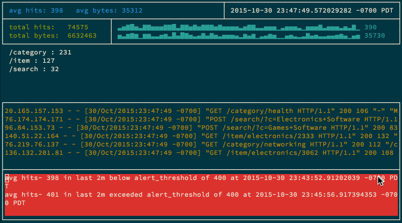

# d2top

Follows an apache log, generates stats, displays them in a console.



I wrote this as a solution to a programming challenge and also to learn Go. This is literally the first code I've written in Go and I was learning it as I went along, so there's a few silly and/or inefficient bits.

The design was inspired by statsd. Logs stream in and the individual fields get parsed out. Every n seconds, there is a flush event- the log data gets rolled up, averaged out; URLs, error codes, user-agents, etc get added up and sorted by occurrence. Then these stats are written to a bucket and appended to a slice of buckets, and we do that every interval.

The UI was built with https://github.com/jroimartin/gocui

I've only tested it with the log generator mentioned below.

## Build

1. Ensure you have Go installed and $GOPATH set
2. Fetch d2top `git clone git@github.com:benwtr/d2top.git d2top && cd d2top`
3. Install dependencies `go get`
4. Build `go build`

## Run

1. For generating junk logs, I’ve been using https://github.com/tamtam180/apache_log_gen/ `gem install --no-ri --no-rdoc apache-loggen`
2. Start writing out a log `apache-loggen --rate=46 > access.log`
3. In a new terminal window or tab, start the d2top program `./d2top access.log`

## Requirements

The original coding challenge that this project is a solution to:
```
Create a simple console program that monitors HTTP traffic on your machine:

- Consume an actively written-to w3c-formatted HTTP access log

- Every 10s, display in the console the sections of the web site with the most hits (a section is defined as being what's before the second '/' in a URL. i.e. the section for "http://my.site.com/pages/create' is "http://my.site.com/pages"), as well as interesting summary statistics on the traffic as a whole.

- Ensure a user can keep the console app running and monitor traffic on their machine

- Whenever total traffic for the past 2 minutes exceeds a certain number on average, add a message saying that “High traffic generated an alert - hits = {value}, triggered at {time}”

- Whenever the total traffic drops again below that value on average for the past 2 minutes, add another message detailing when the alert recovered

- Make sure all messages showing when alerting thresholds are crossed remain visible on the page for historical reasons.

- Write a test for the alerting logic
```
